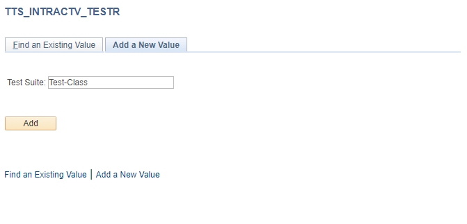
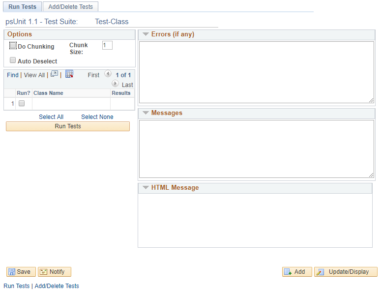
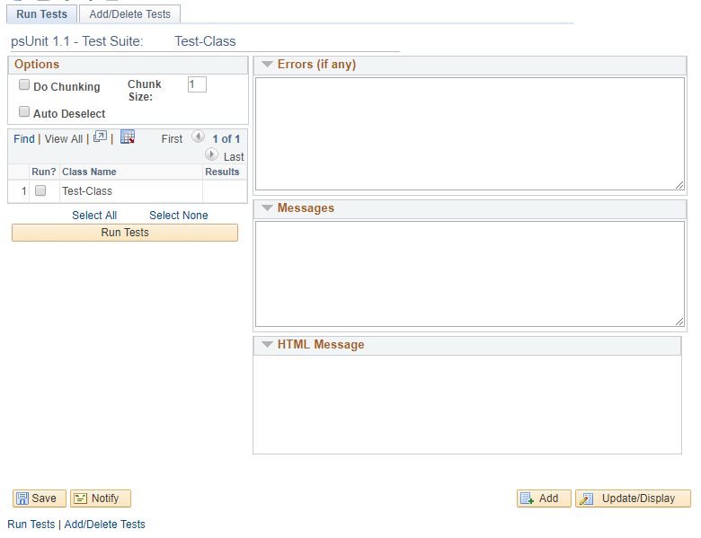

# PSUnit - Unit test framework for PeopleSoft

## Disclaimer
PSUnit is taken directly from Oracle, with a few modifications. You used to be able to get the the original PSUnit project from the [download link](http://blogs.oracle.com/peopletools/resource/TTS_UNIT.zip) on the Oracle Blog, but it has since disappeared (404) in all of the places I have looked for it.

The copyright for PSUnit is (probably) held by Jim Marion/David Bain of Oracle, although that was years ago, so it might have changed since then. Regardless, there was not an explicit copyright stated, so I want to re-iterate that this is not my own work, but it didn't exist in Github, so I wanted to showcase it there so that you could browse the source code and download the project xml. In [the blog about its release](https://blogs.oracle.com/peopletools/psunit-unit-test-framework-for-peoplesoft), it is specified as "open source," which _probably_ means using it is safe. 😊

## About PSUnit
PSUnit is a PeopleSoft testing framework that is patterned after xUnit. It is intended to be a help for Test-Driven-Design, or TDD, which essentially means writing the tests before the code to ensure that your code is testable. Making testable code is always a good goal, because then a unit test (like PSUnit) can be run which will verify in a small amount of time that your code is likely working.

As mentioned before, PSUnit used to be an internal thing for PeopleSoft, but it appears to now be open source. To find out more information about PSUnit, you can go to [the blog post about it](https://blogs.oracle.com/peopletools/psunit-unit-test-framework-for-peoplesoft), or the [Introduction document](https://cdn.app.compendium.com/uploads/user/e7c690e8-6ff9-102a-ac6d-e4aebca50425/f4a5b21d-66fa-4885-92bf-c4e81c06d916/File/e98ccf7ddbcd84e03d9ba46d3b896cfc/testdrivenblogpost.pdf) by Jim Marion.

## Modifications
I have written a new `BaseTest` class, which slightly modifies the way that unit tests are run. This can be found under [Y_TEST:BaseTest](./ApplicationPackagePeopleCode/Y_TEST/BaseTest.pcode). The delivered code can all be found under [TTS_UNITTEST](./ApplicationPackagePeopleCode/TTS_UNITTEST). The custom modifications include the ability to count the number of assertions that were made, as well as a couple of additional methods that I thought might be helpful for test purposes. I have also modified a handful of the methods to take different actions that I thought were helpful.

Also included is a method that will allow you to run all of the tests in your test class automatically. For this to work, all of the desired test methods must start with `test`, have no parameters, and be declared as `public` or `protected` in the class. The `BaseTest` class will run all of the tests it can find.

## Usage
To get PSUnit working in your PeopleSoft environment, you should download the files in [TTS_UNIT](./Project/TTS_UNIT) that contains the project TTS_UNIT (The code for the project is reflected here for convenience). To get it to work, you can register the `TTS_INTRACTV_TESTR` component under a menu of your choosing, or else the project file will contain a Content Reference for it (under Root, I think...). The "TTS" code will be up to date, but if you plan on using my custom class to help you, I would then copy the code from github into app designer for [Y_TEST:BaseTest](./ApplicationPackagePeopleCode/Y_TEST/BaseTest.pcode).

### Writing your class
Once you have done that, you can go into the code for my [custom class](./ApplicationPackagePeopleCode/Y_TEST/BaseTest.pcode) and copy the first bit of code, which is a template for new classes. For convenience, this is the code contained there:

	/* Basic Test-Class structure 
	import Y_TEST:BaseTest;

	class Test-Class extends Y_TEST:BaseTest
	   method Test-Class();
	   method RunHook();
	protected
	   rem tests;
	private
	   rem helper methods;
	end-class;

	method Test-Class
	   %Super = create Y_TEST:BaseTest("Test-Class");
	end-method;

	method RunHook
	   /+ Extends/implements Y_TEST:BaseTest.Run +/
	   rem either run manually;
	   <run test methods>
	   %This.tests = <number-of-tests-run>;
	   
	   rem or run automatically;
           rem %This.runTestMethodsInClass(String(%this));
	end-method;
	*/

Replace `Test-Class` everywhere that it appears with the name of your test class. Put new test methods in the class definition (probable in the `private` section under `rem tests;`, and replace `<run test methods>` with calls to the methods you put there. Finally, if you want, you can replace `<number-of-tests-run>` in `%This.tests = <number-of-tests-run>;` with a number that indicates the actual number of methods that you want. This is used in the output for tests.

### Adding your class to the Framework
Once you have moved the project into the desired environment, navigate to the content reference. Once there, you can add a new test:

Call it what you will. Then you will enter a landing page:

You can click the top tab that is called Add/Delete Tests. That will take you to this page:

Once you add the class you want, you can return to the landing page, check the test you want to run, and then run it:

